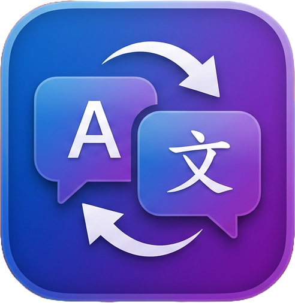

<div align="center">



# LangSwitcher

**Typed in the wrong keyboard layout? Double-tap Shift.**

[](https://github.com/vozivrom/lang-switcher/actions/workflows/ci.yml)
[](https://github.com/vozivrom/lang-switcher/releases/latest)

</div>

---

You meant to type `house`, but the Russian layout was active and you got `рщгыу`.
Double-tap Shift and it becomes `house` — and your keyboard switches with it.

```
рщгыу  ──double-tap⇧──►  house  ──double-tap⇧──►  рщгыу
```

It works on the last word you typed, or on whatever you've selected. Nothing is
translated and nothing leaves your Mac: the keys you pressed are simply read
through a different layout.

## Install

Download the latest DMG from [**Releases**](https://github.com/vozivrom/lang-switcher/releases/latest),
drag LangSwitcher to Applications, and open it.

macOS will say it can't verify the developer — the app isn't notarized, which
needs a paid Apple account. Click **Done**, then open **System Settings →
Privacy & Security**, scroll to **Security**, and click **Open Anyway**.

Then enable LangSwitcher under **Privacy & Security → Accessibility**. It needs
this to read the word you're fixing and type the replacement. If you ever miss a
permission, the app tells you which one and takes you to the right pane.

Requires macOS 13 or later on Apple Silicon.

## Using it

Click the globe in the menu bar to set things up.

**Layouts** — every keyboard layout installed on your Mac can join the cycle,
read from the system rather than a fixed list. Add Czech in System Settings and
it shows up here. Each double-tap moves to the next layout in the list and wraps
around, so with three layouts you cycle through all three; drag to reorder.

**Trigger** — double-tap Shift, Command, Option or Control.

**Scope** — convert the last word, or everything in the field.

**Remember layout per app** *(optional)* — restores the layout you last used in
each app when you switch back, so a chat app can stay Russian while your editor
stays English.

It runs in the background, has no Dock icon, and starts at login.

## Building from source

```sh
./build.sh                       # build the app
cp -R build/LangSwitcher.app /Applications/
./package.sh                     # build a distributable DMG
```

No Xcode project and no dependencies — just `swiftc` and system frameworks, so
the Command Line Tools are enough.

`build.sh` signs with a certificate named `LangSwitcher Self-Signed` when your
keychain has one, and falls back to ad-hoc otherwise. This matters more than it
sounds: an ad-hoc signature is tied to the exact binary, so macOS treats every
build as a different app and makes you re-grant Accessibility each time. Signing
with a certificate keeps the grant across updates.

The version in `VERSION` is the single source of truth — it's stamped into the
bundle and names the DMG. Pushing a `v*` tag builds and publishes a release, and
the workflow rejects a tag that disagrees with `VERSION`.

## How it works

A `CGEventTap` watches for the trigger being tapped twice in quick succession.
The app asks the focused text field for the word through the Accessibility API,
reinterprets the keys through the next layout — using `UCKeyTranslate`, so the
character map comes from macOS itself — puts the result back, and switches the
input source. Your clipboard is restored afterwards.

Replacing text works differently across apps, so there are three strategies:
setting the selection directly (native apps), walking left with `⇧←`
(Chromium apps like VS Code), and deleting before pasting (terminals, where the
shell owns the cursor and ignores the selection).

## License

MIT
