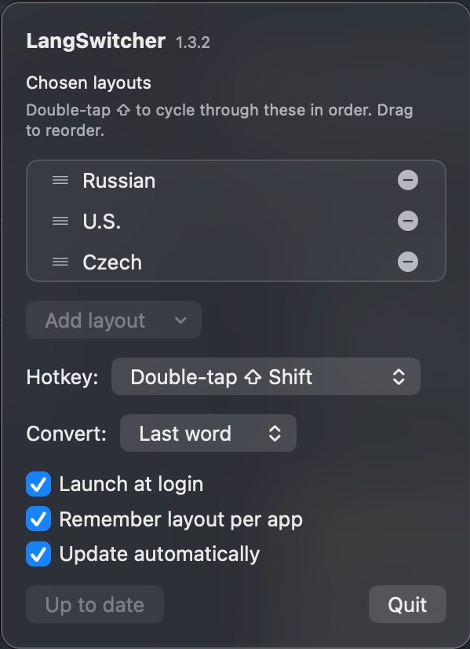

<div align="center">


# LangSwitcher

**Typed in the wrong keyboard layout? Double-tap Shift.**

[](https://github.com/vozivrom/lang-switcher/actions/workflows/ci.yml)
[](https://github.com/vozivrom/lang-switcher/releases/latest)

</div>

---

You meant to type `house`, but another layout was active and you got `рщгыу`.
Double-tap Shift and it becomes `house` — and your keyboard switches with it.

**Any keyboard layout installed on your Mac works.** Layouts are read from macOS
itself rather than a built-in list, so Russian, Ukrainian, Czech, German, Greek,
Hebrew — whatever you've added in System Settings — can be part of the cycle,
with nothing to configure in the app.

```
рщгыу   ──double-tap⇧──►   house      Russian ⇄ English
d;m     ──double-tap⇧──►   dům        English ⇄ Czech
```

Pick two layouts and it toggles between them. Pick more and each press moves to
the next, wrapping around — so with English, Russian and Czech you cycle through
all three.

It works on the last word you typed, or on whatever you've selected. Nothing is
translated and no text ever leaves your Mac: the keys you pressed are simply read
through a different layout — which is why punctuation and digits come along too
(`;` is `ж` on the Russian layout, and `2` is `ě` on Czech).

## Install

Download the latest DMG from [**Releases**](https://github.com/vozivrom/lang-switcher/releases/latest),
drag LangSwitcher to Applications, and open it.

macOS will say it can't verify the developer — the app isn't notarized, which
needs a paid Apple account. Click **Done**, then open **System Settings →
Privacy & Security**, scroll to **Security**, and click **Open Anyway**.

Then enable LangSwitcher under **Privacy & Security → Accessibility**. It needs
this to read the word you're fixing and type the replacement. If you ever miss a
permission, the app tells you which one and takes you to the right pane.

Requires macOS 13 or later on Apple Silicon.

## Using it

Click the globe in the menu bar to set things up.

<div align="center">
  
</div>

**Layouts** — pick which of your installed layouts to cycle through, and in what
order. Add one in **System Settings → Keyboard → Input Sources** and it appears
here straight away; remove it there and it disappears. Drag to reorder.

**Trigger** — double-tap Shift, Command, Option or Control.

**Scope** — convert the last word, or everything in the field.

**Remember layout per app** *(optional)* — restores the layout you last used in
each app when you switch back, so a chat app can stay Russian while your editor
stays English.

**Update automatically** *(optional, off by default)* — checks GitHub once a day
and installs a newer version if there is one. A download is only installed if it
carries the same signing certificate as the copy you're running, so nothing else
can be substituted for it. This is the only feature that uses the network; leave
it off and the app makes no connections at all.

It runs in the background, has no Dock icon, and starts at login.

## Building from source

```sh
./build.sh                       # build the app
cp -R build/LangSwitcher.app /Applications/
./package.sh                     # build a distributable DMG
```

No Xcode project and no dependencies — just `swiftc` and system frameworks, so
the Command Line Tools are enough.

`build.sh` signs with a certificate named `LangSwitcher Self-Signed` when your
keychain has one, and falls back to ad-hoc otherwise. This matters more than it
sounds: an ad-hoc signature is tied to the exact binary, so macOS treats every
build as a different app and makes you re-grant Accessibility each time. Signing
with a certificate keeps the grant across updates.

The version in `VERSION` is the single source of truth — it's stamped into the
bundle and names the DMG. Pushing a `v*` tag builds and publishes a release, and
the workflow rejects a tag that disagrees with `VERSION`.

## How it works

A `CGEventTap` watches for the trigger being tapped twice in quick succession.
The app asks the focused text field for the word through the Accessibility API,
reinterprets the keys through the next layout — using `UCKeyTranslate`, so the
character map comes from macOS itself — puts the result back, and switches the
input source. Your clipboard is restored afterwards.

Replacing text works differently across apps, so there are three strategies:
setting the selection directly (native apps), walking left with `⇧←`
(Chromium apps like VS Code), and deleting before pasting (terminals, where the
shell owns the cursor and ignores the selection).

## License

MIT
